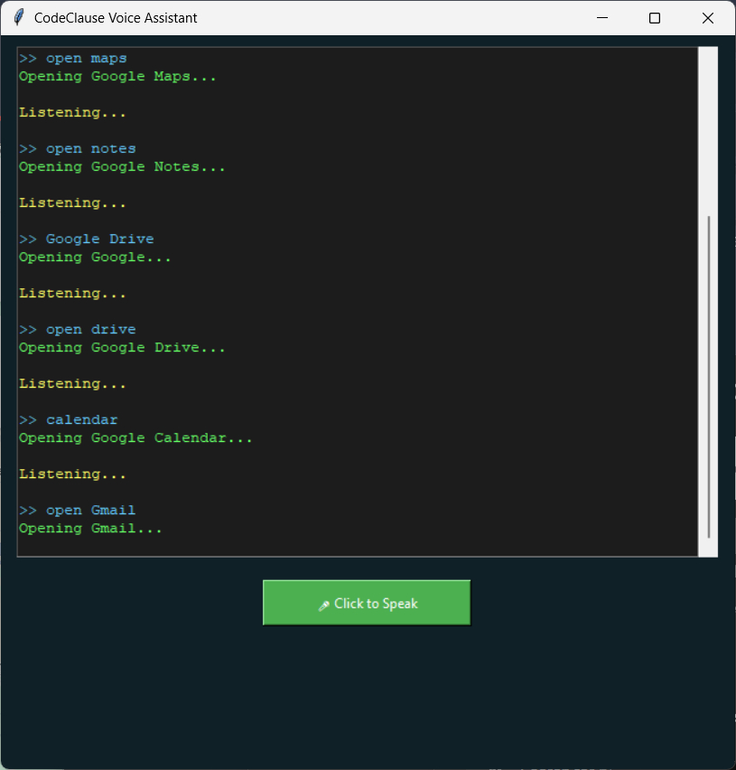
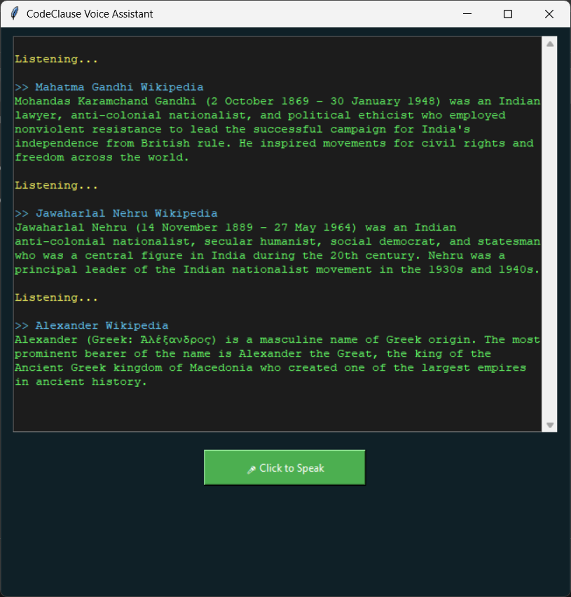

# 🚀 CodeClause Python Internship Tasks

## 🧠 Task: Interactive Voice Assistant (UI Based) ⭐ Golden Project

### 📌 Description
- A Python-based **Interactive Voice Assistant with User Interface**
- Allows users to interact using **voice commands**
- Supports:
  - Voice recognition  
  - Text-to-speech responses  
  - Button-based interaction via UI  
- Provides a more intuitive and user-friendly experience  
- Designed as a **Golden Project** under CodeClause Internship  

## 📂 Project Files
Make sure the following file is present in the same directory:

```text
assistant.py
```
## ⚙️ Technologies Used

- Python  
- SpeechRecognition  
- pyttsx3  
- Tkinter (for UI)  
- PyAudio  

## 📦 Required Libraries

Install the required Python libraries before running the project:

```bash
pip install SpeechRecognition pyttsx3 pyaudio
```
## ⚠️ Note

On some systems, **PyAudio** may require additional setup depending on your operating system.

## ▶️ How to Run

1. Open **Command Prompt** / **Terminal**
2. Navigate to the project directory
3. Run the following command:

```bash
python assistant.py
```
## 📸 Screenshots

### 🔹 AI Knows Its Creator
<p align="center">
  
</p>

### 🔹 Weather Information
<p align="center">
  
</p>

### 🔹 Joke Generation
<p align="center">
  
</p>

### 🔹 Opening YouTube & Websites
<p align="center">
  
</p>

### 🔹 Websites Opened in Chrome
<p align="center">
  
</p>

### 🔹 Wikipedia Search
<p align="center">
  
</p>

### 🔹 AI Topic Search in Chrome
<p align="center">
  
</p>
